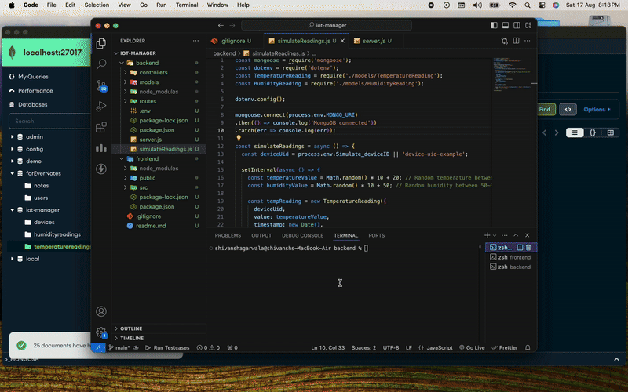

Here’s a README documentation template for your project:

---

# IoT Device Manager - MERN Stack Project

## Overview

This project is built using the MERN stack (MongoDB, Express.js, React.js, Node.js) and consists of three main components:
1. **Backend Server**: Handles API requests and manages device data.
2. **IoT Device Simulation**: Simulates temperature and humidity readings for IoT devices.
3. **Frontend Client**: Provides a user interface to visualize device data.

## Environment Variables

In the `.env` file, you need to specify the following variables:
- `MONGO_URI`: Your MongoDB server URI.
- `PORT`: The port number for the backend server.
- `Simulate_deviceID`: The UID for the device used in the simulation (default: `device-uid-bengaluru`).

**Note:** `Simulate_deviceID` is the name/UID for the device whose readings are being simulated. You can change this UID to simulate readings for different devices.

## Setup Instructions

### Backend and Simulation Setup

1. **Install dependencies**:
    ```bash
    npm install
    ```

2. **Start the backend server**:
    ```bash
    node server.js
    ```

3. **Start the IoT device simulation**:
    ```bash
    node simulateReadings.js
    ```

### Frontend Setup

1. **Navigate to the frontend directory**:
    ```bash
    cd frontend
    ```

2. **Install frontend dependencies**:
    ```bash
    npm install
    ```

3. **Start the frontend server**:
    ```bash
    npm start
    ```

## How to Use

- **Default Device View**: By default, when you access `http://localhost:3000/`, it will connect to the device with UID `device-uid-bengaluru`.
- **View a Specific Device**: To view data for a specific device, use:
    ```
    http://localhost:3000/devices-graph?deviceUid=your-device-uid
    ```

## API Endpoints

1. **Create a Device**  
    - **Endpoint**: `POST /api/devices/`
    - **Content-Type**: `application/json`
    - **Request Payload**:
      ```json
      {
        "uid": "unique-device-id",
        "name": "Device Name"
      }
      ```

2. **Delete a Device**  
    - **Endpoint**: `DELETE /api/devices/{device-uid}`

3. **Retrieve a Device**  
    - **Endpoint**: `GET /api/devices/{device-uid}`

4. **List All Devices**  
    - **Endpoint**: `GET /api/devices/`

5. **Get Device Readings**  
    - **Endpoint**: `GET /api/devices/{device-uid}/readings/{parameter}/`
    - **Query Parameters**:
      - `start_on`: Start time in `yyyy-mm-ddTHH:MM:SS` format.
      - `end_on`: End time in `yyyy-mm-ddTHH:MM:SS` format.

6. **Plot Temperature and Humidity vs Time**  
    - **Endpoint**: `GET /devices-graph/`
    - **Query Parameter**: `deviceUid=your-device-uid`
    - **Description**: Returns an HTML page with graphs plotting temperature and humidity over time.

### Demo

Here’s a GIF demonstrating the frontend in action at 16x speed:




## Project Tasks

### Full Stack Developer Assignment

The tasks completed in this project include:
- Creating APIs for managing IoT devices, including creating, deleting, retrieving, and listing devices.
- Implementing APIs to return temperature and humidity readings for a specific device within a specified time range.
- Developing a UI to visualize temperature and humidity data over time.

---
